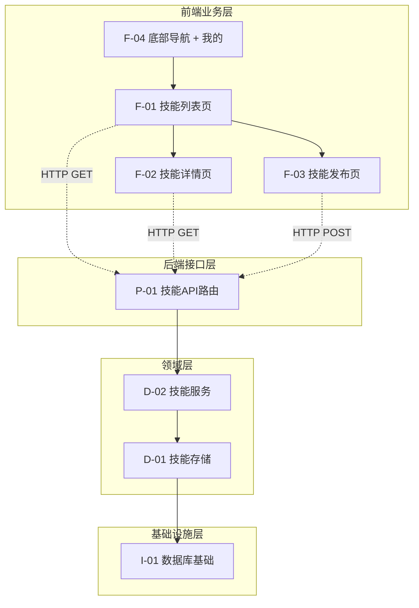

# Skills Share — 全局功能网

## 节点编号表

| 编号 | 功能节点 | 层级 | 域 | 状态 |
|------|---------|------|-----|------|
| I-01 | 数据库基础 | 基础设施 | skill | ✅ |
| D-01 | 技能存储 | 领域 | skill | ✅ |
| D-02 | 技能服务 | 领域 | skill | ✅ |
| P-01 | 技能 API 路由 | 后端接口 | skill | ✅ |
| F-01 | 技能列表页 | 前端业务 | skill | ✅ |
| F-02 | 技能详情页 | 前端业务 | skill | ✅ |
| F-03 | 技能发布页 | 前端业务 | skill | ✅ |
| F-04 | 底部导航 + 我的 | 前端基础 | skill | ✅ |

## 全局网络图

## 存档记录

| 版本 | 日期 | 变更摘要 | 快照 |
|------|------|---------|------|
| v0.0.1 | 2026-06-12 | 技能管理基础版：列表+详情 | [trace](trace/v0.0.1_2026-06-12.md) |
| v0.0.2 | 2026-06-13 | 发布功能+UI改造+底部导航 | [trace](trace/v0.0.2_2026-06-13.md) |
