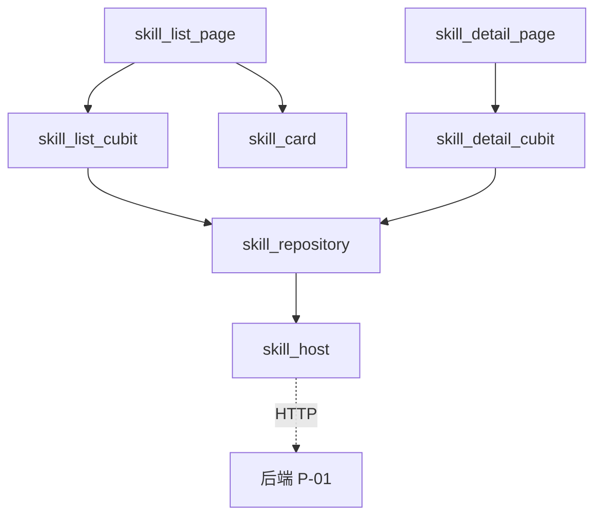
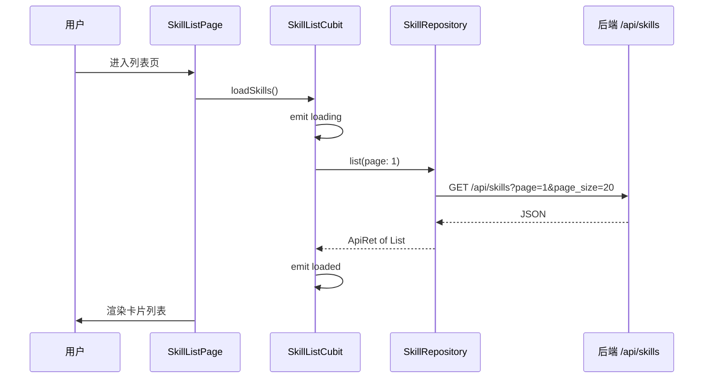

# 技能管理 — 前端局域网络

涉及节点：F-01, F-02

---

## 一、远景：模块与依赖

### 涉及模块

| 模块 | 位置 | 职责（一句话） |
|------|------|--------------|
| skill_host | client/lib/skill/env/skill_host.dart | fx_dio Host 定义，服务地址配置 |
| skill_summary | client/lib/skill/model/skill_summary.dart | 列表数据模型 |
| skill_detail | client/lib/skill/model/skill_detail.dart | 详情数据模型 |
| skill_repository | client/lib/skill/repository/skill_repository.dart | HTTP 请求封装 |
| skill_list_cubit | client/lib/skill/cubit/skill_list_cubit.dart | 列表页状态管理 |
| skill_detail_cubit | client/lib/skill/cubit/skill_detail_cubit.dart | 详情页状态管理 |
| skill_list_page | client/lib/skill/view/skill_list_page.dart | 列表页 UI |
| skill_card | client/lib/skill/view/skill_card.dart | 技能卡片组件 |
| skill_detail_page | client/lib/skill/view/skill_detail_page.dart | 详情页 UI |

### 依赖关系

### 节点详情

| 编号 | 功能节点 | 模块 | 职责 |
|------|---------|------|------|
| F-01 | 技能列表页 | skill_list_page + skill_list_cubit + skill_card | 分页展示技能卡片 |
| F-02 | 技能详情页 | skill_detail_page + skill_detail_cubit | 展示完整信息 + Markdown |

---

## 二、中景：数据通道与事件流

### 数据通道

| 通道 | 协议 | 方向 | 特点 | 例子 |
|------|------|------|------|------|
| 技能列表 | HTTP | 客户端主动 | fx_dio host.get + convertor | SkillRepository.list() |
| 技能详情 | HTTP | 客户端主动 | fx_dio host.get + convertor | SkillRepository.detail(id) |

### 关键事件流

---

## 三、近景：生命周期与订阅

### 核心对象生命周期

| 对象 | 创建时机 | 销毁时机 | 生命跨度 |
|------|---------|---------|---------|
| SkillListCubit | 进入列表页 | 离开列表页 | 页面级 |
| SkillDetailCubit | 进入详情页 | 离开详情页 | 页面级 |
| SkillRepository | Cubit 内实例化 | 随 Cubit 销毁 | 页面级 |

无 Stream 订阅，本版本是纯请求-响应模式。

---

## 四、版本演进

| 版本 | 变更 |
|------|------|
| v0.0.1 | 初始版本：列表页 + 详情页 + fx_dio 集成 |
