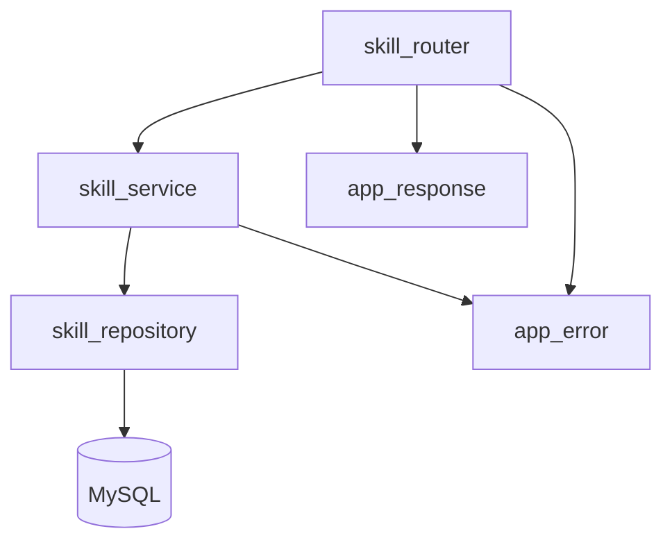
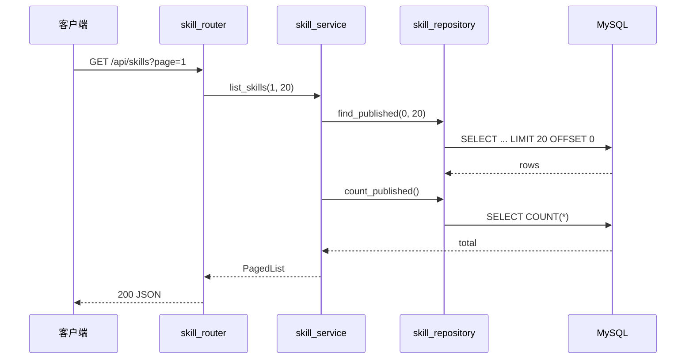

# 技能管理 — 后端局域网络

涉及节点：I-01, D-01, D-02, P-01

---

## 一、远景：模块与依赖

### 涉及模块

| 模块 | 位置 | 职责（一句话） |
|------|------|--------------|
| app_error | server/src/app_error.rs | 统一错误类型（AppError） |
| app_response | server/src/app_response.rs | 统一响应格式 `{ code, data, message }` |
| skill_model | server/src/skill/skill_model.rs | 数据结构定义 |
| skill_repository | server/src/skill/skill_repository.rs | SQL 查询封装 |
| skill_service | server/src/skill/skill_service.rs | 业务逻辑（分页、校验） |
| skill_router | server/src/skill/skill_router.rs | HTTP 路由定义 |

### 依赖关系

### 节点详情

| 编号 | 功能节点 | 模块 | 职责 |
|------|---------|------|------|
| I-01 | 数据库基础 | MySqlPool + app_error + app_response | 连接池、统一错误、统一响应 |
| D-01 | 技能存储 | skill_repository | skills 表 CRUD 操作 |
| D-02 | 技能服务 | skill_service | 分页校验、业务逻辑 |
| P-01 | 技能 API 路由 | skill_router | GET /api/skills, GET /api/skills/:id, POST /api/skills |

---

## 二、中景：数据通道与事件流

### 数据通道

| 通道 | 协议 | 方向 | 特点 | 例子 |
|------|------|------|------|------|
| 技能列表 | HTTP GET | 客户端主动 | 分页查询，不含 content | GET /api/skills?page=1&page_size=20 |
| 技能详情 | HTTP GET | 客户端主动 | 含完整 Markdown content | GET /api/skills/:id |
| 创建技能 | HTTP POST | 客户端主动 | 供 seed 脚本使用 | POST /api/skills |

### 关键事件流

### 边界接口

**HTTP 接口**

| 接口 | 提供节点 | 消费节点 |
|------|---------|---------|
| GET /api/skills | P-01 | F-01 |
| GET /api/skills/:id | P-01 | F-02 |
| POST /api/skills | P-01 | seed.py |

---

## 四、版本演进

| 版本 | 变更 |
|------|------|
| v0.0.1 | 初始版本：建表、列表查询、详情查询、创建接口 |
