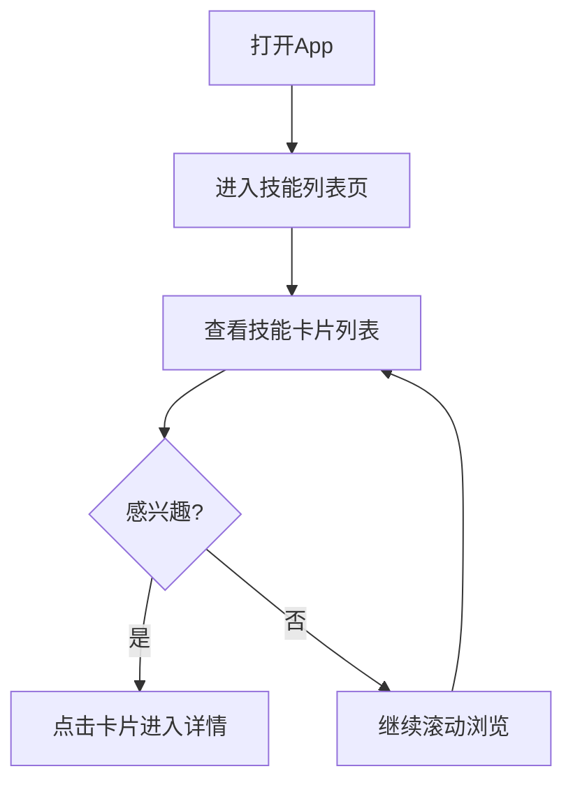
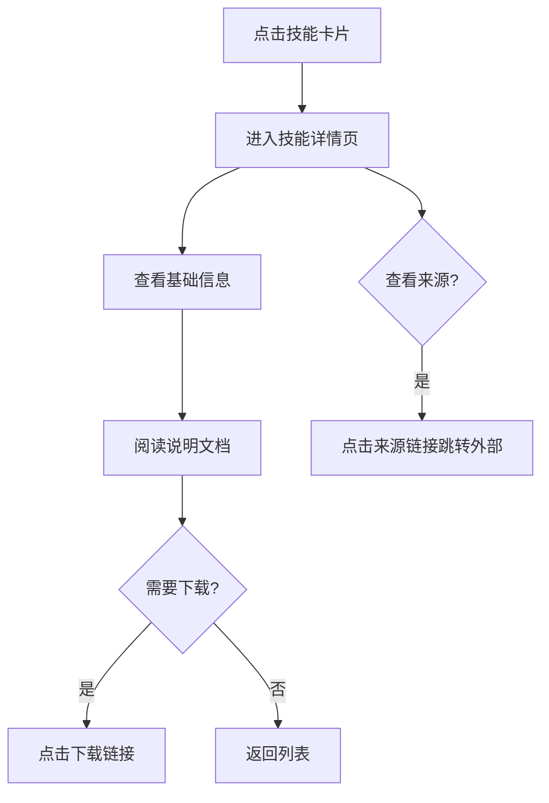
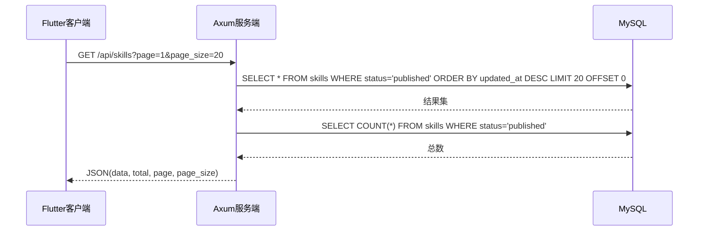
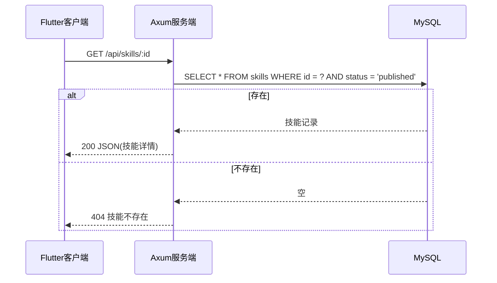

# 技能管理 — 功能分析

## 概述

技能管理是 Skills Share 社区的基础模块。本版本实现技能信息的展示能力：后端提供列表和详情查询接口，前端 Flutter 实现浏览和详情查看。数据通过直接操作数据库导入，不涉及创建/编辑/删除 API。

## 一、交互链

### 场景 1：浏览技能列表

**用户故事**：作为访客，我想浏览所有已发布的技能，以便找到我感兴趣的工具。

用户打开 App，进入技能列表页，看到按更新时间排列的技能卡片。每张卡片显示技能图标、名称、描述摘要、作者、标签。用户可以向下滚动加载更多。

### 场景 2：查看技能详情

**用户故事**：作为访客，我想查看某个技能的完整信息，以便了解它的用途和使用方式。

用户从列表点击某个技能卡片，进入详情页。详情页展示完整信息：名称、作者、版本号、描述、标签、来源链接、下载链接、Markdown 格式的说明文档。用户可以点击来源链接跳转到外部网站，也可以点击下载链接获取技能。

## 二、逻辑树

### 事件流：浏览技能列表

| 时刻 | 事件 | 处理 | 产生的新事件 |
|------|------|------|-------------|
| T1 | 客户端请求列表 | 接收分页参数(page, page_size) | 查询数据库 |
| T2 | 查询数据库 | SELECT skills WHERE status='published' ORDER BY updated_at DESC LIMIT/OFFSET | 返回结果集 |
| T3 | 返回结果集 | 组装响应 JSON（列表 + 总数 + 分页信息） | 响应客户端 |

### 事件流：查看技能详情

| 时刻 | 事件 | 处理 | 产生的新事件 |
|------|------|------|-------------|
| T1 | 客户端请求详情 | 解析路径参数 ID | 查询数据库 |
| T2 | 查询数据库 | SELECT * FROM skills WHERE id = ? AND status='published' | 返回记录/空 |
| T3a | 记录存在 | 组装完整响应 JSON | 响应客户端 |
| T3b | 记录不存在 | 返回 404 | 响应客户端 |

### 状态流转

| 实体 | 触发事件 | 前状态 | 后状态 |
|------|---------|--------|--------|
| Skill 记录 | 数据库手动插入 | 不存在 | published（已发布） |

说明：本版本所有数据通过直接操作数据库导入，状态固定为 `published`。status 字段预留 draft/archived 值，供后续版本使用。

## 三、功能编号与网络定位

### 本次新增节点

| 编号 | 功能节点 | 层级 | 简介 |
|------|---------|------|------|
| I-01 | 数据库基础 | 基础设施层 | MySQL 连接池、通用错误处理、统一响应格式 |
| D-01 | 技能存储 | 领域层 | skills 表定义、查询方法 |
| D-02 | 技能服务 | 领域层 | 分页查询、详情查询逻辑 |
| P-01 | 技能 API 路由 | 后端接口层 | GET 列表 + GET 详情 |
| F-01 | 技能列表页 | 前端业务层 | 分页展示已发布技能卡片 |
| F-02 | 技能详情页 | 前端业务层 | 展示技能完整信息和 Markdown 文档 |

### 前置依赖

| 依赖节点 | 依赖方式 | 是否已有 |
|----------|---------|---------|
| MySQL 数据库实例 | 连接池 | ✅ 已有（.env 配置） |
| Axum HTTP 框架 | 框架基础 | ✅ 已有 |
| Flutter 运行环境 | 客户端基础 | ✅ 已有 |

### 边界接口

| 接口/协议 | 定义方 | 消费方 | 敏感度 |
|-----------|--------|--------|--------|
| GET /api/skills | 后端 | Flutter 客户端 | 低（公开数据） |
| GET /api/skills/:id | 后端 | Flutter 客户端 | 低（公开数据） |

## 四、结论

- **开发顺序建议**：先后端（建表 → 查询接口 → 测试），再前端（列表页 → 详情页）
- **复杂度集中的地方**：Markdown 内容的前端渲染、分页逻辑
- **暂不实现的部分**：
  - 创建/编辑/删除 API — 本版本数据通过数据库直接导入
  - 用户注册/登录系统 — 无需身份认证
  - 技能搜索/筛选 — 后续版本按需添加
  - 草稿/下架状态切换 — 字段预留，接口暂不开放
  - 评论、收藏、评分 — 属于社区互动，后续版本
  - 图标上传 — 本版本使用 URL 引用外部图片
