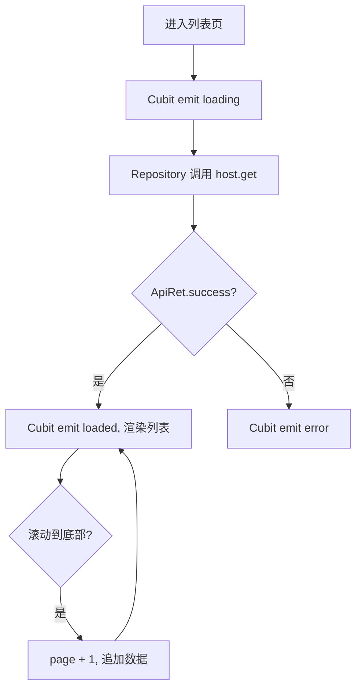
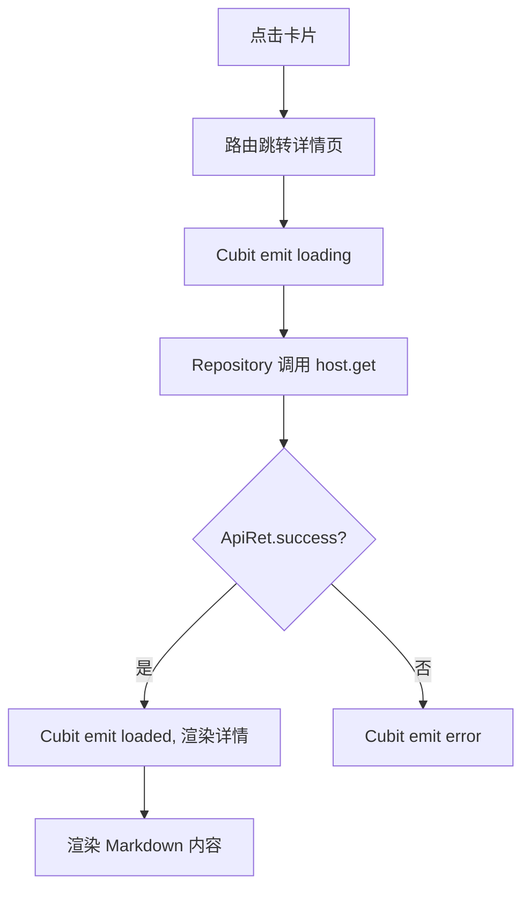

# 技能管理 — 前端设计报告

> 关联设计：[技能管理 v0.0.1 分析](../analysis.md) | [技能管理 v0.0.1 后端](../server/design.md)

## 1. 目标

- 实现技能列表页，分页展示已发布技能卡片
- 实现技能详情页，展示完整信息和 Markdown 说明文档
- 基于 fx_dio 搭建网络请求层（Host + Repository）
- 基于 flutter_bloc 搭建状态管理（Cubit 模式）

## 2. 现状分析

- Flutter 项目为初始模板状态，只有默认的 Counter 示例
- 无任何业务代码、状态管理、网络请求基础设施
- 需要从零搭建：fx_dio Host 注册、Cubit 状态管理、路由、Markdown 渲染

## 3. 数据模型与接口

### 数据模型（Client）

```dart
/// 技能摘要（列表用）
class SkillSummary {
  final int id;
  final String name;
  final String description;
  final String author;
  final String tags;
  final String iconUrl;
  final String sourceUrl;
  final String version;
  final String downloadUrl;
  final String createdAt;
  final String updatedAt;

  factory SkillSummary.fromApi(dynamic map);
}

/// 技能详情（含 content）
class SkillDetail {
  final int id;
  final String name;
  final String description;
  final String author;
  final String tags;
  final String iconUrl;
  final String sourceUrl;
  final String version;
  final String downloadUrl;
  final String content;
  final String status;
  final String createdAt;
  final String updatedAt;

  factory SkillDetail.fromApi(dynamic map);
}
```

| 决策 | 理由 |
|------|------|
| Summary 和 Detail 分开定义 | 字段不同（Detail 多 content/status），避免 nullable 字段 |
| 使用 fromApi 工厂方法 | 遵循 fx_dio convertor 模式 |

### 接口消费

| 接口 | 用途 |
|------|------|
| GET /api/skills?page=N&page_size=M | 列表页分页加载 |
| GET /api/skills/:id | 详情页获取完整数据 |

## 4. 核心流程

### 列表加载流程



### 详情加载流程



## 5. 项目结构与技术决策

### 项目结构

```
client/lib/
├── main.dart                          # 入口：fx_dio 注册、App 启动
└── skill/
    ├── env/
    │   └── skill_host.dart            # Host 定义 + HostMixin
    ├── model/
    │   ├── skill_summary.dart         # 列表数据模型
    │   └── skill_detail.dart          # 详情数据模型
    ├── repository/
    │   └── skill_repository.dart      # API 调用（fx_dio 风格）
    ├── cubit/
    │   ├── skill_list_cubit.dart      # 列表页状态管理
    │   ├── skill_list_state.dart      # 列表页状态定义
    │   ├── skill_detail_cubit.dart    # 详情页状态管理
    │   └── skill_detail_state.dart    # 详情页状态定义
    └── view/
        ├── skill_list_page.dart       # 列表页
        ├── skill_card.dart            # 技能卡片组件
        └── skill_detail_page.dart     # 详情页
```

### 职责划分

```
View（UI 渲染、用户交互）
  ↓ 调用
Cubit（状态管理、加载/错误状态流转）
  ↓ 调用
Repository（host.get 请求、convertor 数据转换）
  ↓ 调用
Host（fx_dio，服务地址、环境配置）
```

- View 只关心 Widget 树和用户事件，不直接调用 Repository
- Cubit 只管状态流转，不关心 UI 细节
- Repository 使用 fx_dio 的 host.get + convertor 模式
- Host 定义服务地址，通过 FxDio().register() 注册

### 技术决策

| 决策 | 方案 | 理由 |
|------|------|------|
| 状态管理 | flutter_bloc（Cubit 模式） | 简单清晰，不需要 Event 模式 |
| 网络请求 | fx_dio | 项目规范要求，Host + Repository + convertor 模式 |
| Markdown 渲染 | flutter_markdown_plus | flutter_markdown 已 deprecated |
| 路由 | Navigator push 简单跳转 | 页面少，不需要路由框架 |
| 图片加载 | cached_network_image | 列表中加载远程图标，需要缓存 |

**第三方依赖清单：**

| 依赖 | 用途 | 已有/需新增 |
|------|------|------------|
| fx_dio | 网络请求框架 | 🆕 需新增 |
| flutter_bloc ^9.1.1 | 状态管理 | 🆕 需新增 |
| flutter_markdown_plus ^0.7.1 | Markdown 渲染 | 🆕 需新增 |
| cached_network_image ^3.3.1 | 图片缓存加载 | 🆕 需新增 |
| url_launcher | 打开外部链接 | 🆕 需新增 |

## 6. 验收标准

| 验收条件 | 验收方式 |
|----------|----------|
| 编译通过 | `flutter analyze` 无错误 |
| 列表页展示技能卡片 | 手动启动 App 查看 |
| 滚动加载更多 | 滚动到底部触发加载下一页 |
| 点击卡片跳转详情 | 手动操作验证 |
| 详情页渲染 Markdown | 查看格式化内容展示 |
| 点击来源/下载链接跳转 | 手动操作验证外部链接 |
| 网络错误有提示 | 断开服务验证 |

## 7. 暂不实现

| 功能 | 理由 |
|------|------|
| 搜索/筛选 | 后端接口未提供，后续版本 |
| 下拉刷新 | 第一版先做分页加载，后续优化体验 |
| 技能创建/编辑 UI | 本版本无用户系统 |
| 离线缓存 | 第一版纯在线浏览 |
| 深色模式适配 | 后续统一处理 |
