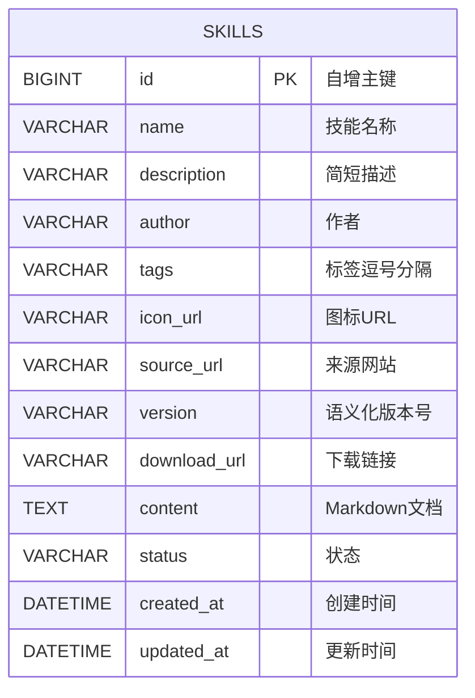
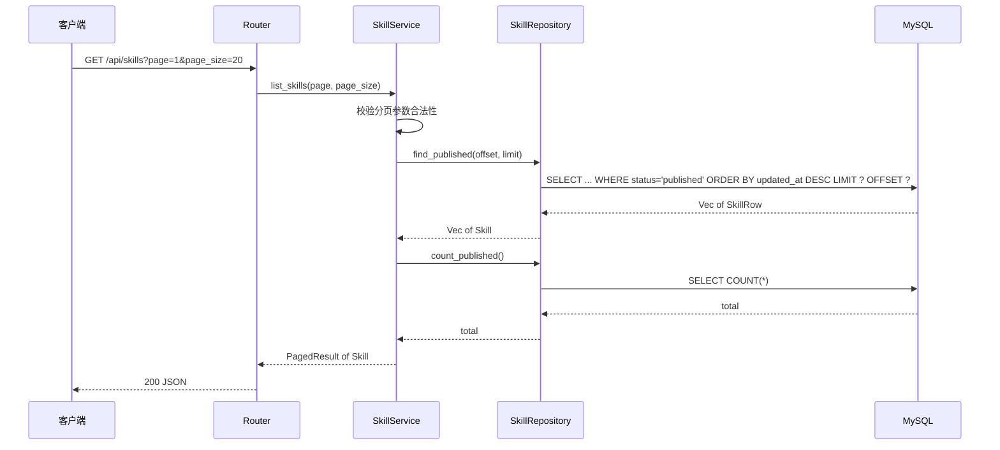
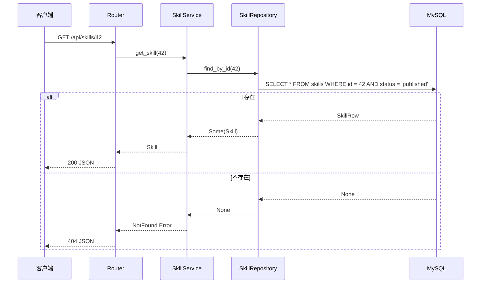

# 技能管理 — 后端设计报告

> 关联设计：[技能管理 v0.0.1 分析](../analysis.md)

## 1. 目标

- 建立 skills 数据表，存储技能的完整信息
- 提供技能列表分页查询接口
- 提供技能详情查询接口
- 建立后端分层架构（路由 → 服务 → 存储）

## 2. 现状分析

- 后端使用 Axum + SQLx + MySQL，已有连接池和基础路由
- 当前只有 health check 和 date 查询两个演示接口
- 缺少分层架构（所有逻辑都在 main.rs）
- 缺少统一错误处理和响应格式

## 3. 数据模型与接口

### 数据模型

```sql
CREATE TABLE skills (
    id          BIGINT UNSIGNED NOT NULL AUTO_INCREMENT PRIMARY KEY,
    name        VARCHAR(100)    NOT NULL COMMENT '技能名称',
    description VARCHAR(500)    NOT NULL DEFAULT '' COMMENT '简短描述',
    author      VARCHAR(100)    NOT NULL DEFAULT '' COMMENT '作者',
    tags        VARCHAR(500)    NOT NULL DEFAULT '' COMMENT '标签，逗号分隔',
    icon_url    VARCHAR(500)    NOT NULL DEFAULT '' COMMENT '图标URL',
    source_url  VARCHAR(500)    NOT NULL DEFAULT '' COMMENT '来源网站URL',
    version     VARCHAR(50)     NOT NULL DEFAULT '0.0.1' COMMENT '语义化版本号',
    download_url VARCHAR(500)   NOT NULL DEFAULT '' COMMENT '下载链接',
    content     TEXT            NOT NULL COMMENT 'Markdown说明文档',
    status      VARCHAR(20)     NOT NULL DEFAULT 'published' COMMENT '状态: draft/published/archived',
    created_at  DATETIME        NOT NULL DEFAULT CURRENT_TIMESTAMP COMMENT '创建时间',
    updated_at  DATETIME        NOT NULL DEFAULT CURRENT_TIMESTAMP ON UPDATE CURRENT_TIMESTAMP COMMENT '更新时间',
    INDEX idx_status (status),
    INDEX idx_updated_at (updated_at)
) ENGINE=InnoDB DEFAULT CHARSET=utf8mb4 COMMENT='技能表';
```



| 决策 | 理由 |
|------|------|
| tags 用逗号分隔字符串而非关联表 | 第一版数据量小，查询简单，后续可升级为多对多 |
| content 用 TEXT 类型 | Markdown 文档可能较长，TEXT 最大 64KB 足够 |
| id 用 BIGINT UNSIGNED | 预留扩展空间 |
| status 索引 | 列表查询固定过滤 published 状态 |

### 接口契约

**接口总览：**

| 方法 | 路径 | 说明 |
|------|------|------|
| GET | /api/skills | 技能列表（分页） |
| GET | /api/skills/:id | 技能详情 |
| POST | /api/skills | 创建技能（供 seed 脚本使用） |

---

**GET /api/skills — 技能列表**

请求参数（Query）：
```json
{
  "page": 1,         // 页码，默认 1
  "page_size": 20    // 每页条数，默认 20，最大 100
}
```

成功响应（200）：
```json
{
  "code": 0,
  "data": {
    "list": [
      {
        "id": 1,
        "name": "示例技能",
        "description": "这是一个示例",
        "author": "toly",
        "tags": "效率,工具",
        "icon_url": "https://example.com/icon.png",
        "source_url": "https://github.com/xxx",
        "version": "1.0.0",
        "download_url": "https://example.com/download",
        "created_at": "2026-06-12 10:00:00",
        "updated_at": "2026-06-12 10:00:00"
      }
    ],
    "total": 50,
    "page": 1,
    "page_size": 20
  },
  "message": "success"
}
```

注意：列表接口不返回 `content` 字段（Markdown 文档），避免传输过大。

---

**GET /api/skills/:id — 技能详情**

成功响应（200）：
```json
{
  "code": 0,
  "data": {
    "id": 1,
    "name": "示例技能",
    "description": "这是一个示例",
    "author": "toly",
    "tags": "效率,工具",
    "icon_url": "https://example.com/icon.png",
    "source_url": "https://github.com/xxx",
    "version": "1.0.0",
    "download_url": "https://example.com/download",
    "content": "# 技能说明\n\n这里是 Markdown 内容...",
    "status": "published",
    "created_at": "2026-06-12 10:00:00",
    "updated_at": "2026-06-12 10:00:00"
  },
  "message": "success"
}
```

错误响应（404）：
```json
{
  "code": 404,
  "data": null,
  "message": "技能不存在"
}
```

---

**POST /api/skills — 创建技能**

供 seed 脚本调用，用于灌入种子数据和验证接口。

请求体（JSON）：
```json
{
  "name": "示例技能",
  "description": "这是一个示例",
  "author": "toly",
  "tags": "效率,工具",
  "icon_url": "https://example.com/icon.png",
  "source_url": "https://github.com/xxx",
  "version": "1.0.0",
  "download_url": "https://example.com/download",
  "content": "# 技能说明\n\nMarkdown 内容..."
}
```

成功响应（201）：
```json
{
  "code": 0,
  "data": {
    "id": 1
  },
  "message": "success"
}
```

错误响应（400）：
```json
{
  "code": 400,
  "data": null,
  "message": "name 不能为空"
}
```

## 4. 核心流程

### 列表查询流程



### 详情查询流程



## 5. 项目结构与技术决策

### 项目结构

```
server/src/
├── main.rs                 # 入口：初始化、路由注册、启动服务
├── net_util.rs             # 工具：获取局域网 IP（已有）
├── app_error.rs            # 统一错误类型（AppError: bad_request/not_found/internal）
├── app_response.rs         # 统一响应格式封装（{ code, data, message }）
└── skill/
    ├── mod.rs              # 模块导出
    ├── skill_model.rs      # 数据模型（Skill 结构体 + 序列化）
    ├── skill_repository.rs # 存储层（SQLx 查询）
    ├── skill_service.rs    # 服务层（业务逻辑 + 分页）
    └── skill_router.rs     # 路由层（接口定义 + 参数提取）

scripts/
├── deploy/
│   └── db.py              # 数据库结构管理（migrate/clear/reset）
└── server/
    ├── seed.py            # 种子数据灌入（通过 HTTP 接口）
    └── seed.json          # 种子数据定义
```

### 职责划分

```
Router（参数提取、响应组装）
  ↓ 调用
Service（业务逻辑、参数校验）
  ↓ 调用
Repository（SQL 查询、数据映射）
  ↓ 操作
MySQL
```

- Router 只做参数解析和响应封装，不含业务判断
- Service 负责校验逻辑和组装结果，不直接写 SQL
- Repository 只关心数据库操作，不含业务规则

### 技术决策

| 决策 | 方案 | 理由 |
|------|------|------|
| 分层架构 | Router → Service → Repository | 职责清晰，利于后续功能扩展 |
| 统一响应格式 | `{ code, data, message }` 包装 | 前端统一解析，错误处理一致 |
| 错误处理 | AppError 统一类型，handler 返回 `Result<Json<...>, AppError>` | 遵循项目规范，用 `?` 传播，业务错误用便捷方法 |
| 分页方式 | LIMIT/OFFSET | 数据量小，简单够用；大数据量时可改游标分页 |
| 时间序列化 | 字符串格式 "YYYY-MM-DD HH:mm:ss" | 前端无需额外解析 |
| 按模块目录组织 | `skill/` 子目录 | 后续新增模块平行展开，不混乱 |

**第三方依赖：**

| 依赖 | 用途 | 已有/需新增 |
|------|------|------------|
| axum 0.7 | HTTP 框架 | ✅ 已有 |
| sqlx 0.7 (mysql) | 数据库操作 | ✅ 已有 |
| serde / serde_json | 序列化 | ✅ 已有 |
| tokio | 异步运行时 | ✅ 已有 |
| tower-http | CORS + Trace | ✅ 已有 |
| thiserror | 错误类型派生 | 🆕 需新增 |

## 6. 验收标准

| 验收条件 | 验收方式 |
|----------|----------|
| 代码编译通过 | `cargo build` 无错误 |
| skills 表创建成功 | `python scripts/deploy/db.py migrate` 成功 |
| GET /api/skills 返回分页列表 | curl 请求验证 JSON 格式正确 |
| GET /api/skills/:id 返回详情 | curl 请求验证包含 content 字段 |
| POST /api/skills 创建成功 | seed.py 调用验证返回 201 |
| 不存在的 ID 返回 404 | curl 请求验证错误响应格式 |
| 列表不包含 content 字段 | 检查列表响应中无 Markdown 内容 |
| 种子数据灌入成功 | `python scripts/server/seed.py` 全部通过 |

## 7. 暂不实现

| 功能 | 理由 |
|------|------|
| 创建/编辑/删除接口 | 本版本只做展示，数据通过 SQL 直接导入 |
| 搜索/筛选 | 后续版本按需添加，表索引已预留 |
| 状态切换 API | status 字段已预留，接口后续开放 |
| 身份认证/鉴权 | 无用户系统，所有接口公开访问 |
| 文件上传（图标） | 本版本使用外部 URL 引用 |
| 缓存 | 数据量小，直接查库即可 |
