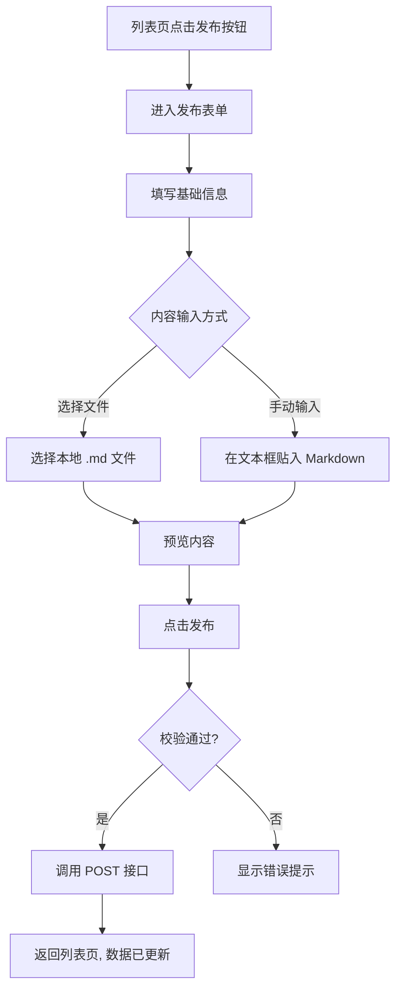
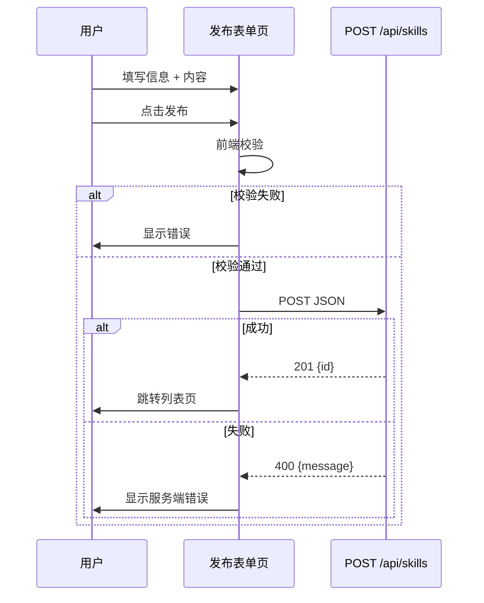

# 技能管理 v0.0.2 — 功能分析

## 概述

本版本在 v0.0.1 基础上增加两项能力：（1）用户可以在前端上传/发布自己的技能；（2）种子数据替换为真实存在的 AI 编程技能。

## 一、交互链

### 场景 1：上传技能

**用户故事**：作为社区用户，我想把自己写的技能发布到社区，让更多人看到并使用。

用户在列表页点击"发布技能"按钮，进入发布表单页。填写名称、描述、作者、标签、来源URL、版本号、下载链接，然后选择内容输入方式：选择本地 Markdown 文件，或手动在文本框中贴入 Markdown。点击发布后，技能立即出现在列表中。

## 二、逻辑树

### 事件流：上传技能

| 时刻 | 事件 | 处理 | 产生的新事件 |
|------|------|------|-------------|
| T1 | 用户点击发布 | 前端校验必填字段（name, content） | 校验通过/失败 |
| T2 | 校验通过 | 调用 POST /api/skills | 等待响应 |
| T3 | 收到 201 | 跳转列表页，触发刷新 | 列表更新 |
| T3b | 收到 400 | 显示错误信息 | 无 |

## 三、功能编号与网络定位

### 本次新增节点

| 编号 | 功能节点 | 层级 | 简介 |
|------|---------|------|------|
| F-03 | 技能发布页 | 前端业务层 | 表单输入 + 文件选择 + 提交 |

### 前置依赖

| 依赖节点 | 依赖方式 | 是否已有 |
|----------|---------|---------|
| P-01 技能 API 路由 (POST /api/skills) | HTTP 接口 | ✅ v0.0.1 已实现 |
| D-02 技能服务 | 业务校验 | ✅ v0.0.1 已实现 |
| D-01 技能存储 | 数据写入 | ✅ v0.0.1 已实现 |
| F-01 技能列表页 | 页面跳转 + 发布入口 | ✅ 已有 |

## 四、结论

- **开发顺序**：先更新种子数据（纯数据操作），再做前端发布页
- **复杂度集中**：表单页 UI 布局（多字段 + 内容输入切换 + 预览）
- **暂不实现**：编辑、删除、审核、草稿保存
