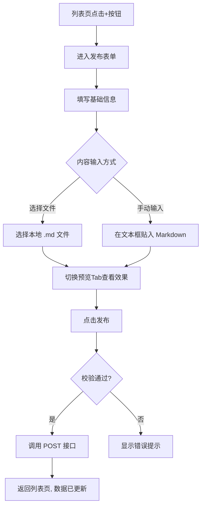
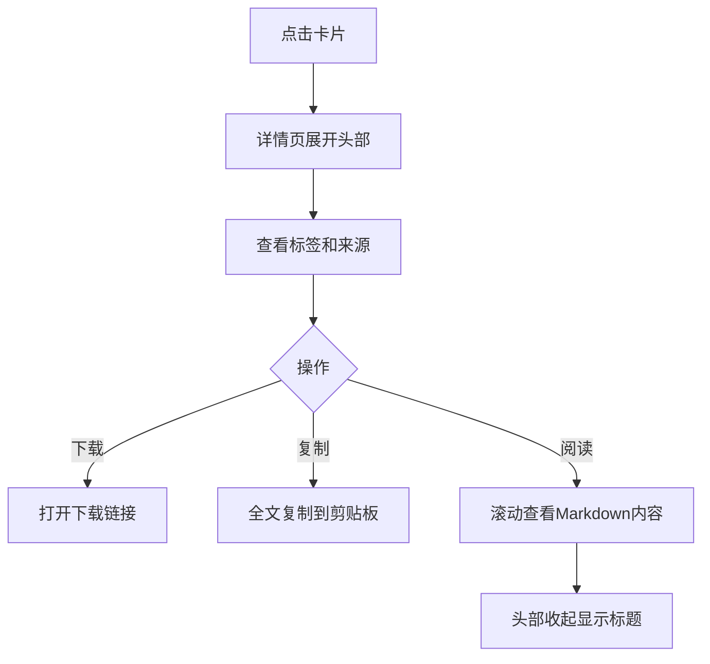

# 技能管理 v0.0.2 — 功能分析

## 概述

本版本在 v0.0.1 基础上增加三大能力：（1）用户可以在前端上传/发布自己的技能；（2）微信简洁风 UI 全面改造 + 橙色品牌色；（3）底部导航栏、详情页折叠头部等体验优化。

## 一、交互链

### 场景 1：上传技能

**用户故事**：作为社区用户，我想把自己写的技能发布到社区，让更多人看到并使用。

用户在列表页点击"+"按钮，进入发布表单页。填写名称、描述、作者、标签、来源URL、版本号、下载链接，然后选择内容输入方式：选择本地 Markdown 文件，或手动在文本框中贴入 Markdown，并可切换到预览 Tab 查看渲染效果。点击发布后，技能立即出现在列表中。

### 场景 2：浏览详情（增强）

**用户故事**：作为访客，我想查看技能的完整信息，并能一键下载或复制全文。

用户点击卡片进入详情页，折叠头部展示图标、名称、版本、作者、标签、来源链接，底部有"下载技能"和"复制全文"两个操作按钮。滚动后头部收起，AppBar 显示技能名称。下方 Tab 面板展示 SKILL.md 内容（含代码块语法高亮）。

### 场景 3：Tab 导航

**用户故事**：作为用户，我想在首页和个人页之间切换。

底部导航栏两个 Tab：首页（技能广场）、我的。使用不可滑动 PageView 切换。

## 二、逻辑树

### 事件流：上传技能

| 时刻 | 事件 | 处理 | 产生的新事件 |
|------|------|------|-------------|
| T1 | 用户点击发布 | 前端校验必填字段（name, content） | 校验通过/失败 |
| T2 | 校验通过 | 调用 POST /api/skills | 等待响应 |
| T3 | 收到成功响应 | pop 返回列表页，调用 loadSkills 刷新 | 列表更新 |
| T3b | 收到 400 | SnackBar 显示错误信息 | 无 |

## 三、功能编号与网络定位

### 本次新增节点

| 编号 | 功能节点 | 层级 | 简介 |
|------|---------|------|------|
| F-03 | 技能发布页 | 前端业务层 | 表单输入 + 文件选择 + Markdown 预览 + 提交 |
| F-04 | 底部导航 + 我的页面 | 前端基础层 | AppShell + PageView + MinePage |

### 前置依赖

| 依赖节点 | 依赖方式 | 是否已有 |
|----------|---------|---------|
| P-01 技能 API 路由 (POST /api/skills) | HTTP 接口 | ✅ v0.0.1 已实现 |
| D-02 技能服务 | 业务校验 | ✅ v0.0.1 已实现 |
| D-01 技能存储 | 数据写入 | ✅ v0.0.1 已实现 |
| F-01 技能列表页 | 页面跳转 + 发布入口 | ✅ 已有 |
| F-02 技能详情页 | UI 增强 | ✅ 已有 |

## 四、结论

- **开发顺序**：先更新种子数据机制，再做 UI 改造，最后做发布功能
- **复杂度集中**：详情页 SliverAppBar 折叠效果、Markdown 代码块语法高亮
- **暂不实现**：编辑、删除、审核、草稿保存、搜索筛选
