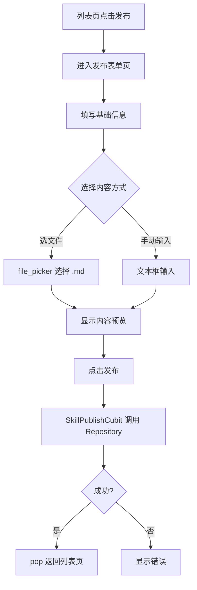

# 技能管理 v0.0.2 — 前端设计报告

> 关联设计：[技能管理 v0.0.2 分析](../analysis.md) | [技能管理 v0.0.1 前端](../../v0.0.1/client/design.md)

## 1. 目标

- 新增技能发布页（表单 + Markdown 文件选择/手动输入 + 实时预览）
- 微信简洁风 UI 全面改造（橙色品牌色 #FF6D00）
- 底部导航栏（首页技能广场 + 我的）
- 详情页 SliverAppBar 折叠头部 + Tab 面板 + 下载/复制按钮
- Markdown 代码块语法高亮（flutter_highlighter）
- 列表页增加发布入口按钮
- 发布成功后返回列表并刷新

## 2. 现状分析

- v0.0.1 已有列表页和详情页
- 后端 POST /api/skills 接口已就绪
- SkillRepository 中尚无 create 方法，需新增
- 需要 file_picker 插件支持选择本地 .md 文件

## 3. 数据模型与接口

### 数据模型（Client）

```dart
/// 创建技能请求
class CreateSkillRequest {
  final String name;
  final String description;
  final String author;
  final String tags;
  final String iconUrl;
  final String sourceUrl;
  final String version;
  final String downloadUrl;
  final String content;
}
```

### 接口消费

| 接口 | 用途 |
|------|------|
| POST /api/skills | 提交新技能 |

## 4. 核心流程



## 5. 项目结构与技术决策

### 新增文件

```
client/lib/skill/
├── model/
│   └── create_skill_request.dart    # 创建请求模型
├── cubit/
│   ├── skill_publish_cubit.dart     # 发布页状态管理
│   └── skill_publish_state.dart     # 发布页状态定义
└── view/
    ├── app_shell.dart               # 底部导航 + PageView
    ├── mine_page.dart               # 我的页面
    └── skill_publish_page.dart      # 发布表单页
```

### 修改文件

```
client/lib/
├── main.dart                        # 入口改为 AppShell
└── skill/
    ├── repository/
    │   └── skill_repository.dart    # 新增 create 方法
    └── view/
        ├── skill_list_page.dart     # AppBar 加发布按钮 + 标题改"技能广场"
        ├── skill_card.dart          # 三行布局 + 橙色标签 + 时间
        └── skill_detail_page.dart   # SliverAppBar + Tab面板 + 代码高亮
```

### 职责划分

- `skill_publish_page.dart`：纯 UI 表单，收集用户输入，调用 Cubit
- `skill_publish_cubit.dart`：校验 + 调用 Repository + 管理 loading/success/error 状态
- `skill_repository.dart`：新增 `create` 方法，调用 POST 接口

### 技术决策

| 决策 | 方案 | 理由 |
|------|------|------|
| 文件选择 | file_picker | 跨平台支持，选择 .md 文件读取内容 |
| 内容输入 | Tab 切换（文件/手动） + 预览 Tab | 三个 Tab：选文件、手动输入、预览 |
| 表单校验 | 前端 + Cubit 层双重 | 即时反馈 + 业务逻辑校验 |

**新增依赖：**

| 依赖 | 用途 | 已有/需新增 |
|------|------|------------|
| file_picker ^8.0.0 | 选择本地文件 | 🆕 需新增 |
| flutter_highlighter ^0.1.1 | 代码块语法高亮 | 🆕 需新增 |
| markdown ^7.2.2 | Markdown AST（builder 需要） | 🆕 需新增 |

## 6. 验收标准

| 验收条件 | 验收方式 |
|----------|----------|
| 编译通过 | `flutter analyze` 无错误 |
| 列表页有发布按钮 | 手动验证 |
| 表单页能填写所有字段 | 手动操作 |
| 能选择 .md 文件并预览内容 | 选择文件后确认内容显示 |
| 能手动输入 Markdown | 切换到手动输入模式验证 |
| 发布成功后返回列表 | 手动操作验证 |
| name/content 为空时提示错误 | 手动验证 |

## 7. 暂不实现

| 功能 | 理由 |
|------|------|
| 图标上传 | 本版本只支持填写 URL |
| 草稿保存 | 后续版本 |
| 编辑/删除 | 后续版本 |
