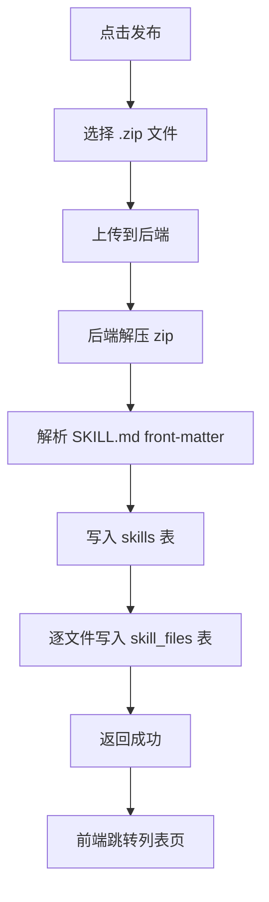
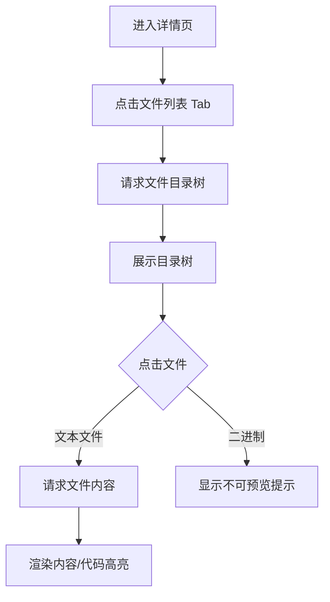
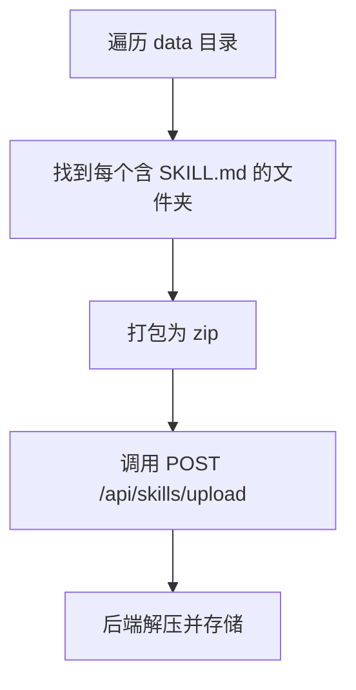
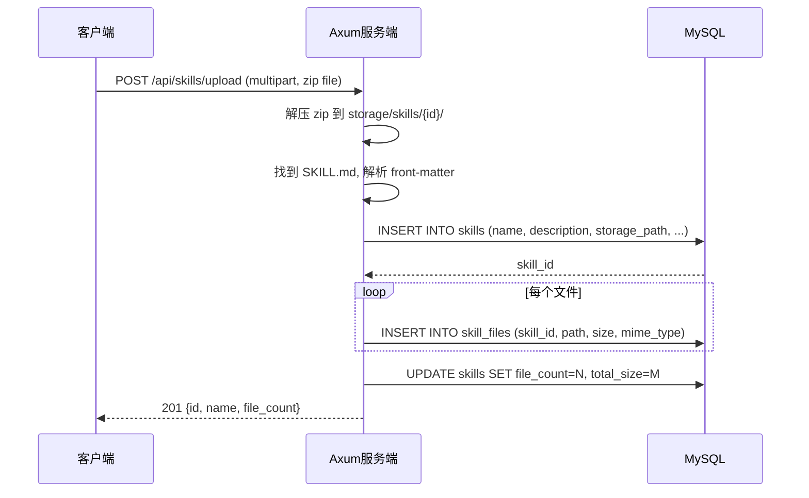
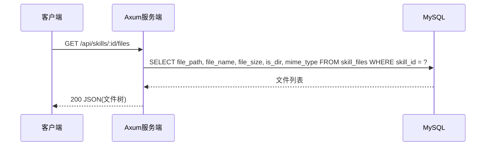
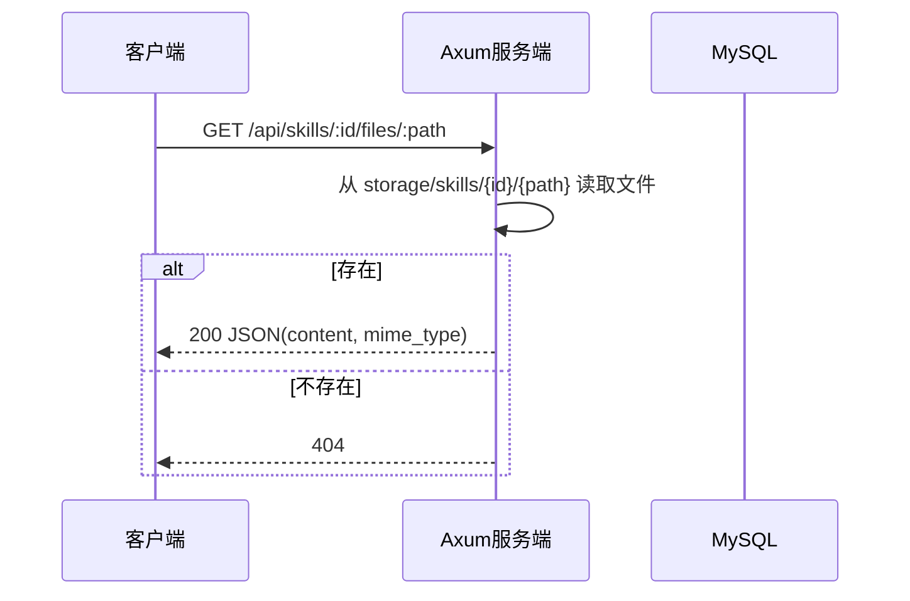

# 技能管理 v0.0.3 — 功能分析

## 概述

技能从"单个 Markdown"升级为"压缩包（文件夹）"。用户上传 zip 包，后端解压存储所有文件，前端可浏览文件目录树和查看单个文件内容。数据库推翻重建。

## 一、交互链

### 场景 1：上传技能压缩包

**用户故事**：作为技能作者，我想把整个技能文件夹打包上传到社区，让别人看到完整内容。

用户在发布页选择一个 zip 文件（包含 SKILL.md + 其他文件），填写补充信息（或由后端从 SKILL.md front-matter 自动提取），点击发布。后端解压 zip，解析 SKILL.md 的 front-matter 作为技能元信息，将所有文件存入 skill_files 表。

### 场景 2：浏览技能文件目录

**用户故事**：作为访客，我想看到一个技能包含哪些文件，了解它的完整结构。

用户在详情页点击"文件列表" Tab，看到目录树结构。可以点击某个文件查看其内容（文本文件渲染，二进制文件显示提示）。

### 场景 3：种子数据灌入

**用户故事**：作为开发者，我想用脚本批量上传本地技能文件夹作为种子数据。

`generate_meta.py` 脚本遍历 `scripts/server/data/` 下的技能文件夹，将每个文件夹打成 zip，调用上传接口灌入。

## 二、逻辑树

### 事件流：上传 zip

| 时刻 | 事件 | 处理 | 产生的新事件 |
|------|------|------|-------------|
| T1 | 收到 multipart 请求 | 接收 zip 文件 | 解压 |
| T2 | 解压 zip | 遍历文件列表，找到 SKILL.md | 解析 front-matter |
| T3 | 解析 front-matter | 提取 name/description/tags 等 | 写入 skills 表 |
| T4 | 写入 skills 表 | 获取 skill_id | 逐文件写入 |
| T5 | 遍历文件 | 每个文件解压到 storage/skills/{id}/，路径信息写入 skill_files 表 | 完成 |
| T6 | 全部完成 | 更新 skills.file_count 和 total_size | 返回响应 |

### 事件流：查询文件列表

| 时刻 | 事件 | 处理 | 产生的新事件 |
|------|------|------|-------------|
| T1 | 请求文件列表 | 查询 skill_files WHERE skill_id = ? | 返回文件树 |

### 事件流：查看单个文件内容

| 时刻 | 事件 | 处理 | 产生的新事件 |
|------|------|------|-------------|
| T1 | 请求文件内容 | 查询 skill_files WHERE skill_id = ? AND file_path = ? | 返回内容 |

### 状态流转

| 实体 | 触发事件 | 前状态 | 后状态 |
|------|---------|--------|--------|
| Skill | zip 上传成功 | 不存在 | published |
| SkillFile | 解压写入 | 不存在 | 存在 |
| Skill | 删除 | published | 不存在（CASCADE 清理 files） |

## 三、功能编号与网络定位

### 本次新增节点

| 编号 | 功能节点 | 层级 | 简介 |
|------|---------|------|------|
| D-03 | 技能文件存储 | 领域层 | skill_files 表 CRUD |
| D-04 | Zip 解析服务 | 领域层 | 解压 zip + 解析 front-matter |
| P-02 | 文件上传路由 | 后端接口层 | POST /api/skills/upload (multipart) |
| P-03 | 文件查询路由 | 后端接口层 | GET /api/skills/:id/files, GET /api/skills/:id/files/:path |
| F-05 | 文件目录树 | 前端业务层 | 详情页文件列表 Tab + 文件内容查看 |

### 本次变更节点

| 编号 | 变更 |
|------|------|
| D-01 | skills 表结构变更（新增 file_count, total_size, entry_file） |
| P-01 | 删除旧 POST /api/skills JSON 接口，改为 upload |
| F-03 | 发布页改为上传 zip |

### 前置依赖

| 依赖节点 | 依赖方式 | 是否已有 |
|----------|---------|---------|
| I-01 数据库基础 | 连接池 | ✅ |
| D-01 技能存储 | 写入 skills 表 | ✅（需改表结构） |
| F-01 技能列表页 | 展示入口 | ✅ |
| F-02 技能详情页 | Tab 面板 | ✅（需接入真实数据） |

### 边界接口

| 接口/协议 | 定义方 | 消费方 | 敏感度 |
|-----------|--------|--------|--------|
| POST /api/skills/upload | 后端 | Flutter + seed 脚本 | 中（写操作） |
| GET /api/skills/:id/files | 后端 | Flutter 客户端 | 低 |
| GET /api/skills/:id/files/:path | 后端 | Flutter 客户端 | 低 |
| GET /api/skills | 后端 | Flutter 客户端 | 低（不变） |
| GET /api/skills/:id | 后端 | Flutter 客户端 | 低（响应扩展 file_count） |

## 四、结论

- **开发顺序**：数据库重建 → 后端 zip 上传 + 文件查询接口 → 种子脚本 → 前端文件树
- **复杂度集中**：zip 解压 + front-matter 解析（Rust 侧）、文件目录树渲染（Flutter 侧）
- **暂不实现**：
  - 文件编辑/更新（只能删了重传）
  - 二进制文件预览（图片等）
  - 单文件大小限制校验
  - zip 嵌套 zip 处理
