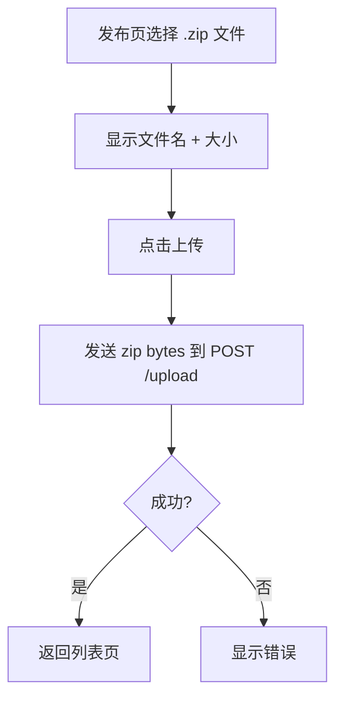
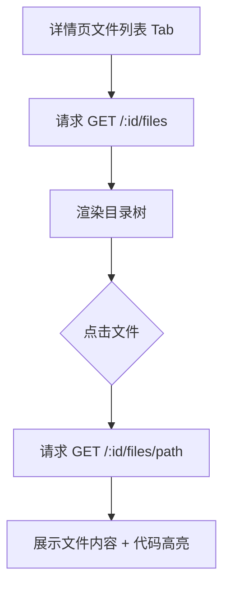

# 技能管理 v0.0.3 — 前端设计报告

> 关联设计：[技能管理 v0.0.3 分析](../analysis.md) | [技能管理 v0.0.3 后端](../server/design.md)

## 1. 目标

- 发布页改为上传 zip 文件（单文件选择 + 上传）
- 详情页"文件列表" Tab 接入真实数据，展示目录树
- 点击文件可查看内容（文本文件 + 代码高亮）
- Repository/Model 适配 v0.0.3 接口

## 2. 现状分析

- v0.0.2 发布页是表单填写模式，需要改为 zip 上传
- v0.0.2 详情页"文件列表" Tab 是静态占位，需要接入 API
- SkillSummary/SkillDetail 模型需要适配新字段（file_count, total_size）
- 需要新增文件相关 Model 和 Repository 方法

## 3. 数据模型与接口

### 数据模型（Client）

```dart
/// 技能摘要（列表，新增 file_count/total_size）
class SkillSummary {
  // ... 原有字段
  final int fileCount;
  final int totalSize;
}

/// 技能详情（新增 entry_content/file_count/total_size/entry_file）
class SkillDetail {
  // ... 原有字段
  final int fileCount;
  final int totalSize;
  final String entryFile;
  final String entryContent;
}

/// 文件条目
class SkillFileItem {
  final int id;
  final int skillId;
  final String filePath;
  final String fileName;
  final int fileSize;
  final bool isDir;
  final String mimeType;
}

/// 文件内容
class FileContent {
  final String filePath;
  final String mimeType;
  final String content;
}
```

### 接口消费

| 接口 | 用途 |
|------|------|
| GET /api/skills | 列表（不变） |
| GET /api/skills/:id | 详情（响应扩展） |
| POST /api/skills/upload | 上传 zip（Content-Type: application/zip） |
| GET /api/skills/:id/files | 文件目录树 |
| GET /api/skills/:id/files/*path | 单文件内容 |

## 4. 核心流程

### 上传 zip



### 文件浏览



## 5. 项目结构与技术决策

### 新增文件

```
client/lib/skill/
├── model/
│   ├── skill_file_item.dart         # 文件条目模型
│   └── file_content.dart            # 文件内容模型
├── cubit/
│   ├── skill_files_cubit.dart       # 文件列表状态
│   └── skill_files_state.dart
└── view/
    ├── skill_files_view.dart        # 文件目录树组件
    └── file_content_page.dart       # 文件内容查看页
```

### 修改文件

```
client/lib/skill/
├── model/
│   ├── skill_summary.dart           # 新增 fileCount/totalSize
│   └── skill_detail.dart            # 改为新响应结构
├── repository/
│   └── skill_repository.dart        # 新增 upload/files/fileContent 方法
├── cubit/
│   └── skill_publish_cubit.dart     # 改为 zip 上传逻辑
└── view/
    ├── skill_publish_page.dart      # 改为 zip 选择 + 上传
    └── skill_detail_page.dart       # 文件列表 Tab 接入真实数据
```

### 技术决策

| 决策 | 方案 | 理由 |
|------|------|------|
| zip 上传 | file_picker 选 .zip + dio 发 bytes | fx_dio 的 host.post 支持 binary body |
| 文件树展示 | 缩进列表 + 图标区分文件/目录 | 简洁够用，不需要 TreeView 插件 |
| 文件内容展示 | 新页面 push，代码高亮复用现有逻辑 | 和详情页的 Markdown 渲染一致 |

## 6. 验收标准

| 验收条件 | 验收方式 |
|----------|----------|
| 编译通过 | `flutter analyze` |
| 选择 zip 并上传成功 | 手动操作验证 |
| 列表显示 file_count | 查看列表卡片 |
| 文件列表 Tab 展示目录树 | 手动操作 |
| 点击文件查看内容 | 手动操作 |
| 代码文件有语法高亮 | 查看 .dart/.py 文件 |

## 7. 暂不实现

| 功能 | 理由 |
|------|------|
| 文件树折叠展开 | 第一版平铺显示 |
| 二进制文件预览 | 后端已返回 400 |
| 文件搜索 | 后续版本 |
