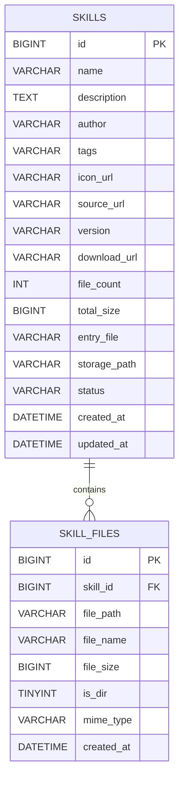
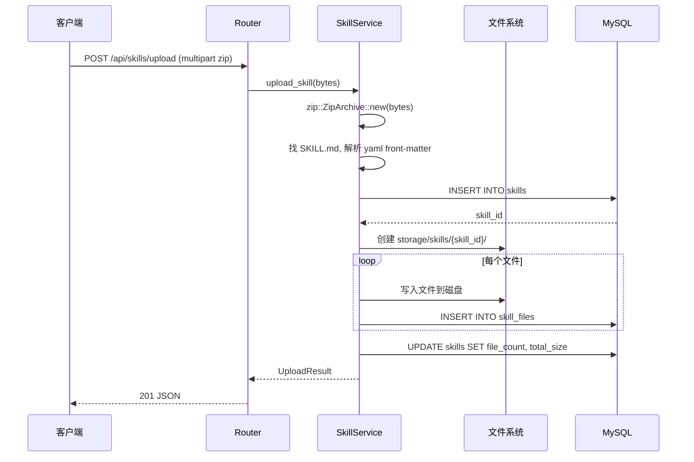

# 技能管理 v0.0.3 — 后端设计报告

> 关联设计：[技能管理 v0.0.3 分析](../analysis.md)

## 1. 目标

- 数据库推翻重建（skills + skill_files 两张表）
- 实现 zip 上传接口（multipart），解压到文件系统，解析 front-matter
- 实现文件目录查询接口
- 实现单文件内容查询接口
- 保留列表和详情查询接口（适配新表结构）

## 2. 现状分析

- v0.0.2 的 skills 表只存单个 Markdown 内容
- 本版本推翻重建，不做兼容迁移
- 需要新增 zip 解压能力（Rust crate: `zip`）
- 需要新增 YAML front-matter 解析能力（Rust crate: `serde_yaml`）
- 需要新增 multipart 文件上传处理（`axum::extract::Multipart`）

## 3. 数据模型与接口

### 数据模型

见 `server/migrations/20260614_001_skills.sql`。

ER 关系：



| 决策 | 理由 |
|------|------|
| 文件内容存磁盘不存数据库 | 文件可能较大，数据库只存元信息，读取时从磁盘读 |
| storage_path 存相对路径 | 方便迁移，实际根路径从环境变量读取 |
| CASCADE 删除 | 删技能时自动清理 skill_files 记录，磁盘文件需额外清理 |
| entry_file 默认 SKILL.md | 详情页默认展示的文件 |

### 接口契约

**接口总览：**

| 方法 | 路径 | 说明 |
|------|------|------|
| GET | /api/skills | 技能列表（分页） |
| GET | /api/skills/:id | 技能详情（含 entry_file 内容） |
| POST | /api/skills/upload | 上传 zip 创建技能 |
| GET | /api/skills/:id/files | 文件目录列表 |
| GET | /api/skills/:id/files/*path | 单文件内容 |
| DELETE | /api/skills/:id | 删除技能（含磁盘清理） |

---

**POST /api/skills/upload — 上传 zip**

请求：`multipart/form-data`，字段 `file`（zip 文件）

成功响应（201）：
```json
{
  "code": 0,
  "data": {
    "id": 1,
    "name": "Feature Analyst",
    "file_count": 5,
    "total_size": 12345
  },
  "message": "success"
}
```

错误响应：
- 400：无文件 / 不是 zip / 缺少 SKILL.md / front-matter 缺少 name
- 500：解压失败 / 写入失败

---

**GET /api/skills/:id/files — 文件目录**

成功响应（200）：
```json
{
  "code": 0,
  "data": [
    {"file_path": "SKILL.md", "file_name": "SKILL.md", "file_size": 2048, "is_dir": false, "mime_type": "text/markdown"},
    {"file_path": "references", "file_name": "references", "file_size": 0, "is_dir": true, "mime_type": ""},
    {"file_path": "references/animation.md", "file_name": "animation.md", "file_size": 1024, "is_dir": false, "mime_type": "text/markdown"}
  ],
  "message": "success"
}
```

---

**GET /api/skills/:id/files/*path — 单文件内容**

成功响应（200）：
```json
{
  "code": 0,
  "data": {
    "file_path": "references/animation.md",
    "mime_type": "text/markdown",
    "content": "# Animation Patterns\n\n..."
  },
  "message": "success"
}
```

错误响应：
- 404：文件不存在
- 400：二进制文件不可预览

---

**DELETE /api/skills/:id — 删除技能**

成功响应（200）：
```json
{
  "code": 0,
  "data": null,
  "message": "success"
}
```

## 4. 核心流程

### Zip 上传流程



## 5. 项目结构与技术决策

### 项目结构

```
server/src/
├── main.rs
├── app_error.rs
├── app_response.rs
├── net_util.rs
└── skill/
    ├── mod.rs
    ├── skill_model.rs          # Skill + SkillFile + UploadResult 结构体
    ├── skill_repository.rs     # 数据库操作（两张表）
    ├── skill_service.rs        # zip 解压 + front-matter 解析 + 文件系统写入
    └── skill_router.rs         # 路由（upload/list/detail/files/delete）

server/storage/skills/          # 技能文件解压存储目录
├── 1/
├── 2/
└── ...
```

### 技术决策

| 决策 | 方案 | 理由 |
|------|------|------|
| zip 解压 | `zip` crate | Rust 生态成熟，支持内存解压 |
| front-matter 解析 | `serde_yaml` | 解析 SKILL.md 开头的 YAML 块 |
| multipart 处理 | `axum::extract::Multipart` | Axum 内置，无需额外依赖 |
| 文件存储 | 磁盘 `storage/skills/{id}/` | 简单直接，大文件友好 |
| 存储根路径 | 环境变量 `STORAGE_PATH` | 可配置，默认 `./storage` |
| MIME 类型推断 | 文件扩展名匹配 | .md → text/markdown, .dart → text/x-dart 等 |
| 删除策略 | DB CASCADE + 磁盘 rm_rf | 数据库外键自动清理，磁盘手动删除目录 |

**新增依赖：**

| 依赖 | 用途 | 已有/需新增 |
|------|------|------------|
| zip | 解压 zip 文件 | 🆕 需新增 |
| serde_yaml | 解析 YAML front-matter | 🆕 需新增 |

## 6. 验收标准

| 验收条件 | 验收方式 |
|----------|----------|
| 代码编译通过 | `cargo build` |
| 数据库重建成功 | `python scripts/deploy/db.py reset` |
| 上传 zip 成功 | curl multipart 上传验证 |
| zip 中无 SKILL.md 返回 400 | curl 验证 |
| 文件目录查询正确 | curl 验证返回文件树 |
| 单文件内容查询正确 | curl 验证返回 Markdown 内容 |
| 删除技能后磁盘目录被清理 | 验证目录不存在 |
| 种子脚本全部通过 | `python scripts/server/generate_meta.py` |

## 7. 暂不实现

| 功能 | 理由 |
|------|------|
| 文件大小限制 | 后续加，当前信任上传者 |
| zip 内嵌套 zip | 不处理 |
| 二进制文件预览（图片） | 返回 400 提示 |
| 技能更新（重新上传） | 只能删了重传 |
| 压缩包保留（原始 zip） | 只保留解压后的文件 |
